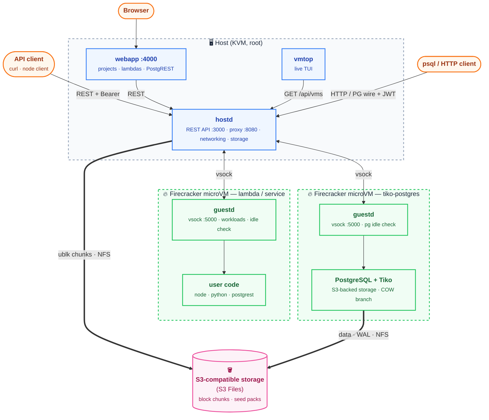

# tikovm

**Firecracker microVMs with a REST API — the compute layer behind [Tiko](https://github.com/burmecia/tiko).**

tikovm turns a single KVM host into a microVM platform. One daemon (`hostd`)
creates VMs, runs commands inside them, snapshots them, and puts their ports on
the network — and it takes care of the boring parts (bridges, NAT, disks, idle
suspension) so a VM feels about as easy to start as a container, while still
being a real VM with its own kernel.

It is the compute half of the Tiko stack: [Tiko](https://github.com/burmecia/tiko)
supplies the serverless Postgres storage engine, tikovm supplies the VMs it
runs in. The bundled demo webapp wires them together — every project gets a
Tiko database VM that freezes when idle and wakes on the first connection.

> [!WARNING]
> **This is a proof-of-concept.** The code is rough, known to be buggy, and
> APIs/config will change without notice. Expect missing pieces, rough edges,
> and data-loss scenarios. **Do not use it for anything you care about.**
> That said, ideas, issues, and contributions are welcome.

---

## Why tikovm?

- 🧱 **VMs that feel like containers.** Create, exec, snapshot, and destroy
  microVMs over a plain REST API. Boot to a working shell takes under ten
  seconds: every VM shares a read-only Ubuntu base image and gets a per-VM
  overlay disk, so there is nothing to copy or install at create time.
- 📴 **Scales to zero.** An idle VM is snapshotted and its Firecracker process
  exits — zero CPU, zero memory, just a snapshot file. The next request (or
  exec, or psql connection) restores it in about a second.
- 🌐 **Networking you don't configure.** Each project gets its own bridge and
  /24 subnet, created with its first VM and torn down with its last. The guest
  IP arrives as a kernel boot argument, so eth0 is up before init runs.
- 🔌 **A proxy that speaks real protocols.** HTTP reverse proxy *and* the
  Postgres wire protocol on one listener, with JWT access scoped per VM and
  port. `psql "host=<proxy> ... options='-c tikovm_token=<jwt>'"` connects
  straight into a database VM; unexposing a port kills existing tokens.
- 💾 **Chunked block storage on S3.** A VM can get a dedicated block device
  backed by chunk files on an [S3 Files](https://docs.aws.amazon.com/AmazonS3/latest/userguide/s3-files.html)
  NFS mount, served by a per-VM ublk worker. A guest fsync becomes one NFS
  COMMIT per dirty chunk; a worker crash looks to the guest exactly like a
  disk power blip, and the device recovers transparently.
- ⏰ **Cron-mode VMs.** Give a VM a cron schedule and it wakes up, runs its
  command as a logged workload, and goes back to sleep — between runs it
  consumes nothing.

---

## How it works



- **hostd** — the daemon. REST API, Firecracker driver, per-project bridges
  and NAT, the JWT-authenticated proxy, chunked block storage, auto-suspend,
  and the cron scheduler.
- **guestd** — the guest agent. A 1 MB Rust binary on vsock that runs
  workloads, streams their output back, and reports idleness. No SSH, no
  guest network dependency.
- **vmtop** — a top-style TUI that polls `GET /api/vms`.
- **webapp** — the demo platform (Express + React): projects with a branched
  Tiko Postgres, paste-in lambda functions (Node 22 / Python 3.12) with public
  invoke URLs, and one-click PostgREST APIs over the project database.
  Everything it does is plain hostd API calls, so it doubles as a reference
  implementation.

---

## Repository layout

```
tikovm/
├── hostd/          # the daemon: REST API, VMM, networking, storage, proxy
├── guestd/         # the guest agent: vsock listener, workloads, idle detector
├── vmtop/          # top-style TUI for the VM inventory
├── webapp/         # demo platform: projects, lambdas, PostgREST (Express + React)
├── clients/node/   # official Node.js/TypeScript client (npm package `tikovm`)
├── scripts/        # run scripts + guest image builds (rootfs/)
├── tests/          # end-to-end shell tests that boot real VMs
└── assets/         # boot artifacts: kernel, initramfs, rootfs images
```

`hostd` and `guestd` are separate binaries deployed to opposite sides of the
VM boundary; guestd deliberately avoids async frameworks so it stays small in
the guest image.

---

## Getting started

Requires a KVM-enabled Linux host (Ubuntu 24.04 x86 recommended), root (hostd
creates bridges, iptables rules, and loop-mounts disks), a `firecracker`
binary on `FIRECRACKER_BIN`, and libclang for the build. AWS EC2 metal
instances or any host with nested virtualization works.

```bash
git clone https://github.com/burmecia/tikovm.git
cd tikovm
rustup show                       # Rust 1.96+, edition 2024

./scripts/download_kernel.sh              # fetch a Firecracker CI kernel
./scripts/build_initramfs.sh              # pack the overlayfs initramfs
./scripts/rootfs/build_rootfs_ubuntu24.sh # build the base guest image
```

Start the daemon (builds as you, runs via `sudo -E`):

```bash
export TIKOVM_HOSTD_API_TOKEN=xxx   # the API's only auth — pick a real one
./scripts/run_hostd.sh
```

In another terminal, watch the VM inventory:

```bash
./scripts/run_vmtop.sh
```

---

## Try it out

### Create a VM and run a command in it

```bash
curl -X POST localhost:3000/api/vms \
  -H "Authorization: Bearer $TIKOVM_HOSTD_API_TOKEN" \
  -H "Content-Type: application/json" \
  -d '{"name":"demo","project_id":"p1","image":"ubuntu-24.04",
       "mode":"permanent","cpus":1,"memory_mb":256,"disk_size_mb":1024}'

curl -X POST localhost:3000/api/vms/$VM_ID/exec \
  -H "Authorization: Bearer $TIKOVM_HOSTD_API_TOKEN" \
  -H "Content-Type: application/json" \
  -d '{"cmd":["uname","-a"]}'
```

### Scale to zero

Create a VM with `auto_suspend` and an exposed port; hit it through the
proxy, then leave it alone:

```json
"auto_suspend": { "idle_timeout_secs": 120 },
"network_config": { "allow_internet": true,
                    "exposed_ports": [{ "port": 8000, "label": "app" }] }
```

Two minutes without a request and the VM is a snapshot file. The next
proxied request restores it — the caller just sees a slower first response.
For non-HTTP services (like Postgres), an in-guest check command decides
idleness instead; the `postgres-16` and `tiko-postgres` images ship one that
watches `pg_stat_activity`.

### The demo webapp

```bash
cd webapp && npm run setup && TIKOVM_HOSTD_API_TOKEN=$TIKOVM_HOSTD_API_TOKEN npm start
# open http://<host>:4000
```

Create a project — ten seconds later it has a running Postgres branched
copy-on-write from a seed pack. Add a lambda by pasting a script, or a
PostgREST VM for an instant REST API over every table. Leave it idle and
everything suspends itself.

### Full test suite

```bash
./tests/run_all.sh   # boots real VMs: lifecycle, networking, proxy,
                     # auto-suspend, cron mode, block storage, ...
```

---

## Roadmap

- [ ] Authentication and multi-user support in the webapp
- [ ] Publish the Node.js client to npm
- [ ] CI for the end-to-end suite
- [ ] Drop `--no-seccomp` and harden the Firecracker jailer setup
- [ ] Code cleanup and hardening

---

## License

Apache-2.0.
